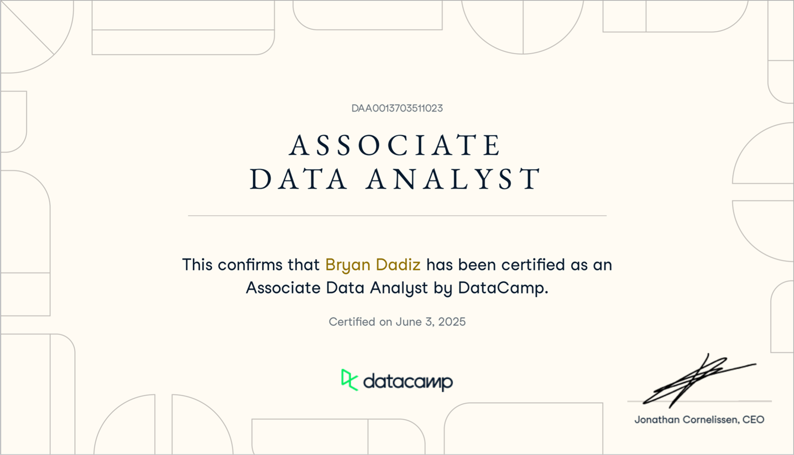

# 💫 About Me:

  
   
  

As a **Data Scientist** and **Machine Learning Engineer**, my professional ethos is anchored in leveraging analytical prowess to drive data-driven decisions and innovation. My industry experience is highlighted by:

- Developing AI-infused web platforms that streamline organizational communication and enhance collaborative workflows.
- Delivering comprehensive analyses and automated processes that optimize e-commerce operations and SEO strategies.
- Utilizing tools such as **Azure**, **PostgreSQL**, **Python**, and more.

I also bring experience in **IT education**, allowing me to distill complex technical concepts into actionable insights. This fusion of hands-on development and insightful instruction positions me to contribute meaningfully to cutting-edge projects and the evolution of intelligent systems in the business sector.

---

## 💼 Experience

### 📊 Data Scientist  
**Bravo Fit Australia** | *Apr 2024 – Mar 2025*

- Developed and automated **end-to-end data ingestion pipelines** using Python and Bash.
- Extracted data from source APIs and loaded it into **Azure Data Warehouse**.
- Transformed large-scale financial and employee datasets using Python and MS SQL (CTEs).
- Delivered analysis-ready datasets for decision-making support.

#### 🔍 Notable Projects (Deployed in Microsoft Fabric / Power BI)
- **Customer Churn Analysis**  
- **Member Attrition Analysis**  
- **Pay Categories Report**  
- **Revenue Accounting Report**  
- **HR Analytics – Employee Tenure Report**

#### 🛠 Tools & Technologies:
`DBeaver`, `Azure Data Studio`, `Visual Studio Code`, `Linux Ubuntu`, `SSH`, `MS SQL`, `Python`, `Power BI`, `Microsoft Fabric`

**Skills**: Business Intelligence, Data Analysis, Data Engineering, Software Engineering

---

### 🤖 AI Engineer  
**CPRAS (Remote Contract)** | *Jul 2022 – Sep 2024*  
*Warrington, England, UK*

- Integrated **OpenAI** models with company knowledge base for enhanced info retrieval and interaction.
- Implemented **GPT-4** for advanced NLP and LLM tasks.
- Developed a **Retrieval Augmented Generation (RAG)** system for generating action-based case templates used by UK environment councils.

#### 🛠 Tools & Technologies:
`Python`, `Django`, `Pinecone Vector DB`, `OpenAI API`

**Skills**: Python, Django, LLMs, OpenAI API

---

### 📈 Data Analyst  
**Hearns Hobbies (Remote Part-Time)** | *Nov 2022 – Feb 2024*  
*Melbourne, Australia*

- Conducted **product and price analysis** by comparing Traxxas RC cars and Tamiya model kits.
- Built **web scraping** and **ETL pipelines** to extract, preprocess, and analyze product data.
- Used tools like **BeautifulSoup**, **Selenium**, **Scrapy**, and **Web APIs** for automated data extraction.

---

### 🎓 Associate Faculty (Level 4)  
**Technological Institute of the Philippines – Manila** | *Jun 2009 – Jul 2024*  
*Manila, Philippines*

- Taught **Computer Science** and **Tech-Related courses**, focusing on **Data Science**, to over 40 students per semester with an average course rating of **93%**.
- Integrated tools such as **Java**, **HTML/CSS**, **JavaScript**, **Python**, **SQL**, **Excel**, and **Power BI** in instruction and project delivery.
- Supervised and led **50+ thesis/capstone projects** involving real-world data analysis (datasets over 400MB), resulting in high-impact, actionable insights for case studies.

---

## 🧰 Tools & Technologies

- Programming: `Python`, `SQL`, `Bash`
- Data Platforms: `Azure`, `MS SQL`, `PostgreSQL`, `Microsoft Fabric`
- Analysis & BI: `Power BI`, `Pandas`, `Numpy`
- Frameworks: `Django`, `OpenAI GPT`, `Scrapy`, `Selenium`
- Development: `Linux`, `VS Code`, `Azure Data Studio`, `DBeaver`, `Git`

---

## 🌐 Socials:
 
  

# 💻 Tech Stack:
## 🧠 Programming Languages

## 🧪 Data Science & Machine Learning

## 🌐 Web & API Frameworks

## 📊 Visualization & Reporting

## 🧰 Tools & Package Management

## 🖥️ Terminals & Scripting

## ☁️ Cloud & DevOps

## 🗄️ Databases

## 🗄️ ERP 

## 🎨 Design & Creative Tools

## 🧠 Productivity

# 📊 GitHub Stats:
 
 

## 🏆 GitHub Trophies

### ✍️ Random Dev Quote

### 🔝 Top Contributed Repo

#### 📝 Datacamp Certification
[DataCamp Certificate: DAA0013703511023](https://www.datacamp.com/certificate/DAA0013703511023)

---

<picture>
  <source media="(prefers-color-scheme: dark)" srcset="https://raw.githubusercontent.com/dadidelux/dadidelux/output/github-snake-dark.svg" />
  <source media="(prefers-color-scheme: light)" srcset="https://raw.githubusercontent.com/dadidelux/dadidelux/output/github-snake.svg" />
  
</picture>

---
  ## 💰 You can help me by Donating
    

  
<!-- Proudly created with GPRM ( https://gprm.itsvg.in ) -->
